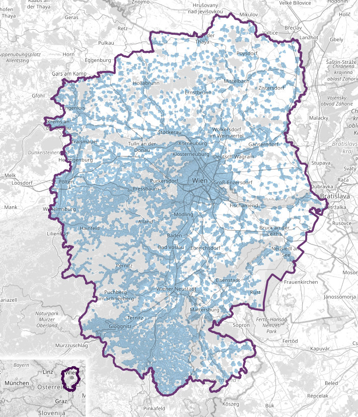

# MATSim Model Vienna 2023.2

This repository contains data for a traffic simulation model for the city and agglomeration of Vienna (Austria)
with [MATSim](https://matsim.org) - the **M**ulti-**A**gent **T**ransport **Sim**ulation.

> [!TIP]
> The 2022 version (covering a smaller area and using proprietary intermodal routing with Ariadne)
> is still available: [MATSim Model Vienna 2022](https://github.com/ait-energy/matsim-model-vienna/tree/2022)

## First Steps

To get the model simply download or clone this repository.

Configs for two widely used *mode innovation* variants are included:
1. `SubtourModeChoice`: can simply be run with the [MATSim GUI](https://matsim.org/downloads/#gui)
2. `DiscreteModeChoice`: requires a custom runner

The model was developed using MATSim 16 but should also work with older (and newer) versions.

## The Model in a Nutshell

- Aims to represent traffic *before* the COVID pandemic (~2020)
- **Simulation Area:** Vienna and surroundings (between 40 and 80km away)
  - area: 11,700 km²
  - total population: 3.05 million (2013-01), 3.275 million (2020-01)
- **Network**: 375k links and 169k nodes extracted from [OpenStreetMap](https://www.openstreetmap.org) (2021) and OGD transit timetables (VOR: Tuesday 2022-06-07, EVU: 2022-10-27) with [pt2matsim](https://github.com/matsim-org/pt2matsim)
- **Facilities:** 654k locations extracted mainly from [OpenStreetMap](https://www.openstreetmap.org)
- **Population synthesis**: based on the Austrian mobility survey *Österreich Unterwegs 2013/14* by Tomschy et al. (2016) with [ARUP PAM](https://github.com/arup-group/pam), scaled up to population of 2020
- **Population**: 332k agents represent 12.5% of the mobile population older than 5 years.
  - Agents use the MATSim modes walk, bike, pt, car, ride.
  - Trips include inside, source, destination and through traffic (see cordon traffic)
  - Traffic by foreign citizens is not included (except for cargo traffic)
- **Cargo traffic**: represented as ~10% reduction in `flowCapacityFactor` and `storageCapacityFactor` and a reduction of all count stations.
- **Routing**: SwissRailRaptor (not Ariadne)
- **Mode choice model:** 10 subpopulations, based on Greene and Hensher (2003), plus an additional subpopulation for cordon trips.
- **Calibration:** on modal split derived from synthesized population

> [!NOTE]
> We tried to use data from 2020 if possible, but often this was not (easily) possible.
> However, we ensured that used data is *comparable* to the situation in 2020,
> e.g. population was scaled up, road and transit system did not change much in two years, etc.

### Coverage Area

Area covered by the MATSim Model Vienna, light-blue areas contain facilities.
The area contains Vienna and large parts of Lower Austria as well as parts of Burgenland
(including St. Pölten, Wiener Neustadt, Hollabrunn, Mistelbach,..)
where people tend to commute to Vienna.

The meter-based projection used for all files is `EPSG:3416`.

### Facilities

Facilities were used for population synthesis and compiled from the following sources.

**Home**: based on [BEV addresses (Adresse Relationale Tabellen - Stichtagsdaten 15.07.2015)](https://www.bev.gv.at/portal/page?_pageid=713,2601271&_dad=portal&_schema=PORTAL)
and [geostat population density](https://ec.europa.eu/eurostat/web/gisco/geodata/reference-data/population-distribution-demography/geostat) based on  census 2011-10-31.

**Work**: based on [Gemeindeergebnisse der Abgestimmten Erwerbsstatistik und Arbeitsstättenzählung](https://www.data.gv.at/katalog/dataset/80598a3d-4bc1-3fe0-b2c3-0febf834327d). [According to WKO](http://wko.at/statistik/eu/europa-beschaeftigungsstruktur.pdf) the Austrian workforce as of 2019 is distributed as follows:
- 70.9% service industry
- 25.4% production (industry)

**Work facilities for Vienna** were taken from Churanek and Steinnocher (2017). Their work features a highly detailed mapping of workplaces to buildings instead relying on of district-wide averages.

### Calibration & Modal Split

A population with four plans per agent (featuring different randomly chosen locations for each plan) serves as base and allows the calibration to implicitly choose the most fitting facility locations.
The model is calibrated to the modal split derived from synthesized population.

Car traffic counts from ~180 automatic counting stations spread over the whole simulation area from the years 2015/2016 are then used with [Cadyts](https://people.kth.se/~gunnarfl/cadyts.html) which runs for 250 (of the total 750) iterations.
The `TimeAllocationMutator` is used with a `mutationRange` of 1h for the first 25 iterations only. The used count data are:
- hourly counts for Vienna for 2015 (cars + trucks): [Straßenverkehrszählung Wien 2015](https://www.digital.wienbibliothek.at/urn/urn:nbn:at:AT-WBR-879281)
- hourly counts for motorways for 2016 (only cars) provided by [ASFINAG](https://www.asfinag.at/verkehr-sicherheit/verkehrszahlung/)

During calibration SwissRailRaptor was set to `<param name="intermodalAccessEgressModeSelection" value="RandomSelectOneModePerRoutingRequestAndDirection"/>` with foot and bike as intermodal access / egress modes

This plot shows modal splits for the whole simulation region:

## Highlights

The model's highlights are **different values of travel time for subpopulations**.

### Cordon Traffic

Agents' trips don't solely consist of trips within the simulation area (inside traffic) but include **trips starting and/or ending outside** (source, destination and through traffic).

This is achieved during population synthesis as follows: trips are trimmed at the border of the simulation area. Cordon entry and exit points are assigned to the appropriate network links in the matching direction, which is especially important for cordon points on motorways. For public transit the exit and entry points are high-ranking train stations. All agents with at least one cordon trip are assigned to the special subpopulation `subpop_cordon_agents`. This allows for separate handling in mode choice.

### Subpopulations & Value of Travel Time

The model features **different values of travel time** for the simulated agents which are represented in the parameters of the Charypar-Nagel function as described in Horni et al. (2016).
These do not depend - as mostly done - on the home location of the agent but on **socio-demographic characteristics assigned to the agents**.

The mode choice model that is part of the joint estimation is a more parsimonious version of the model presented in Schmid et al. (2019), and uses actual and hypothetical trip data.
The time use and expenditure equations are estimated in a similar way as in Hössinger et al. (2020) and Jokubauskaité et al. (2019).
We estimate two classes of coefficients for all parameters, since not much explanatory power is gained by introducing more classes.
The class membership equation then determines for each individual the class membership probability, i.e. how much weight each class of coefficients has for a specific person.
The class membership probability in turn is a linear function of several binary socioeconomic variables sex, age below 35, age above 55, income higher than median, education high-school or above, living in urban area, kids living in the household, single household and full time work with at least 38 hours a week.
The distribution of the class membership probability is then used to define **10 equally large subpopulations**, based on Greene and Hensher (2003).

See subpopulations and their `scoringParameters` in [config-baseline-discreteModeChoice.xml](config-baseline-discreteModeChoice.xml).

## Literature

- Churanek, R. and Steinnocher, K. (2017). Räumliche Modellierung der Tagesbevölkerung in Wien. Proceedings of 22nd International Conference on Urban Planning, Regional Development and Information Society.
- Greene, W. H. and Hensher, D. A. (2003). A latent class model for discrete choice analysis: contrasts with mixed logit. Transportation Research Part B: Methodological, 37(8), 681-698.
- Horni, A., Nagel, K. and Axhausen, K.W. (2016). The Multi-Agent Transport Simulation MATSim. London: Ubiquity Press. DOI: http://dx.doi.org/10.5334/baw. License: CC-BY 4.0
- Hössinger, R., F. Aschauer, S. Jara-Díaz, S. Jokubauskaite, B. Schmid, S. Peer, K. Axhausen and R. Gerike (2020). A joint time-assignment and expenditure-allocation model: value of leisure and value of time assigned to travel for specific population segments. Transportation, Vol. 47, No. 3, 2020, pp. 1439–1475.
- Jokubauskaité, S., R. Hössinger, F. Aschauer, R. Gerike, S. Jara-Díaz, S. Peer, B. Schmid, K. Axhausen and F. Leisch (2019). Advanced continuous-discrete model for joint time-use expenditure and mode choice estimation. Transportation Research Part B: Methodological, Vol. 129, 2019, pp. 397–421
- Schmid, B., S. Jokubauskaite, F. Aschauer, S. Peer, R. Hössinger, R. Gerike, S. R. Jara Diaz and K. Axhausen (2019). A pooled RP/SP mode, route and destination choice model to investigate mode and user-type effects in the value of travel time savings. Transportation Research Part A: Policy and Practice, Vol. 124, 2019, pp. 262–294.17
- Tomschy,  R.,  Herry,  M.,  Sammer,  G.,  Klementschitz,  R.,  Riegler,  S.,  Follmer,  R.,  Gruschwitz,  D.,  Josef, F., Gensasz, S., Kirnbauer, R. and Spiegel, T. (2016). Österreich  unterwegs  2013–2014:  Ergebnisbericht zur österreichweiten  Mobilitätserhebung

### Preferred Citation

If you use the MATSim Model Vienna and write a scientific paper about it, please reference it as

- MATSim Model Vienna 2023.2, © AIT Austrian Institute of Technology GmbH, 2023, licensed CC BY-NC 4.0

and/or cite the following paper as a reference:

- Müller, J., Straub, M., Richter, G., and Rudloff, C. (2022). *Integration of Different Mobility Behaviors and Intermodal Trips in MATSim*. Sustainability. 2022; 14(1):428. https://doi.org/10.3390/su14010428

## License

The open access MATSim Model Vienna is published under license [CC BY-NC 4.0](https://creativecommons.org/licenses/by-nc/4.0).
You may use it for all non-commercial activities, and must give appropriate credit, provide a link to the license, and indicate if changes were made.

## Contact

If you have any questions, remarks, or collaboration ideas, please get in touch:
either via GitHub or via email to `markus.straub` or `johannes.mueller` (both ending on `ait.ac.at`).
