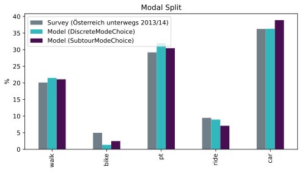

# MATSim Model Vienna: Open Access

This repository contains data for a traffic simulation for the city and agglomeration of Vienna
with [MATSim](https://matsim.org) - the **M**ulti-**A**gent **T**ransport **Sim**ulation.

> **Note:** the 2022 version (covering a smaller area and using proprietary intermodal routing with Ariadne)
> is still available: [MATSim Model Vienna 2022](https://github.com/ait-energy/matsim-model-vienna/tree/2022)

## TODOs before release

- [x] finalize calibration
- [ ] update calibration explanations
- [x] clean population (avoid ÖU data leakage)
- [ ] zip normal population and output events (of last calibration iteration = baseline pop)
  - [ ] upload to nextcloud
- [ ] update modal split numbers and plot
- [ ] do we have a new main citation for our model? (that does not have the ariadne/intermodal stuff as main topic)
- [ ] what are the highlights of the model? (cordons?)

TODO document how we handled
- [ ] through / destination / source traffic:
  - [ ] for Austrian citizens: via cordon points
  - [ ] for foreign citizens: Grundbelastung
- [ ] commercial traffic (Grundbelastung X%)

## First Steps

Download the model:

1. Download or clone this repository
2. Download files (*password: matsim12*) too large for hosting on GitHub and put them it into the folder created in the previous step
   - [full population](https://nextcloud.ait.ac.at/TODO)
   - optional: [output events of both the full and the open access model](https://nextcloud.ait.ac.at/TODO) for further visualization / analysis

Run the simulation:

1. Optionally change the population in the config:
   - Default is the full population (12.5% of the mobile population)
   - For a quick test you can use the small population containing 500 randomly selected agents of the full population
2. Download [MATSim](https://matsim.org/downloads) (tested with version 16)
3. Run the MATSim GUI
   - Select the configuration file
   - Set `Memory` to 4 GB for the full population (or 2 GB for the small population)
   - Start the simulation

> Note: 500 agents is also the maximum number of agents to visualize the results in [Simunto Via](https://simunto.com/via/) with a free license.

## The Model in a Nutshell

- Aims to represent traffic in 2019 just before the COVID pandemic
- **Simulation Area:** Vienna and surroundings (between 40 and 80km away)
  - area: 11,700 km²
  - total population: 3.05 million (2013-01), 3.275 million (2020-01)
- **Network**: 375k links and 169k nodes extracted from [OpenStreetMap](https://www.openstreetmap.org) (2021) and OGD transit timetables (2022) with [pt2matsim](https://github.com/matsim-org/pt2matsim)
- **Facilities:** 654k locations extracted mainly from [OpenStreetMap](https://www.openstreetmap.org)
- **Population synthesis**: based on the Austrian mobility survey *Österreich Unterwegs 2013/14* with [oeu_popsynth](https://gitlab-intern.ait.ac.at/energy/commons/matsim/oeu_popsynth), scaled up to population of 2020
- **Population**: 332k agents represent 12.5% of the mobile population older than 5 years.
  - Agents use the MATSim modes walk, bike, pt, car, ride.
- **Routing**: SwissRailRaptor (not *Ariadne* as in the [2022 version](https://github.com/ait-energy/matsim-model-vienna/tree/2022))
- **Mode choice model:** 10 subpopulations, based on Greene and Hensher (2003).
- **Calibration:** on modal split derived from synthesized population
  - TODO update (also counts!)

Area covered by the MATSim Model Vienna, light-blue areas contain facilities.
The area contains Vienna and large parts of Lower Austria as well as parts of Burgenland
(including St. Pölten, Wiener Neustadt, Hollabrunn, Mistelbach,..)
where people tend to commute to Vienna.

The meter-based projection used for all files is `EPSG:3416`.

### Facilities

Facilities were used for population synthesis and compiled from the following sources.

**Home**: based on [BEV addresses (Adresse Relationale Tabellen - Stichtagsdaten 15.07.2015)](https://www.bev.gv.at/portal/page?_pageid=713,2601271&_dad=portal&_schema=PORTAL)
and [geostat population density](https://ec.europa.eu/eurostat/web/gisco/geodata/reference-data/population-distribution-demography/geostat) based on  census 2011-10-31.

**Work**: based on [Gemeindeergebnisse der Abgestimmten Erwerbsstatistik und Arbeitsstättenzählung](https://www.data.gv.at/katalog/dataset/80598a3d-4bc1-3fe0-b2c3-0febf834327d). [According to WKO](http://wko.at/statistik/eu/europa-beschaeftigungsstruktur.pdf) the Austrian workforce as of 2019 is distributed as follows:
- 70.9% service industry
- 25.4% production (industry)

**Work facilities for Vienna** were taken from Churanek and Steinnocher (2017). Their work features a highly detailed mapping of workplaces to buildings instead relying on of district-wide averages.

### Calibration

TODO update

For calibration we used cadyts and data from ~180 car traffic counters spread over the whole simulation area.

This plot shows the modal split for all inhabitants of the City of Vienna,
i.e. excluding agents with a home location in Lower Austria.

## Highlights

The model's highlights are **different values of travel time for subpopulations**.

### Subpopulations & Value of Travel Time

The model features **different values of travel time** for the simulated agents which are represented in the parameters of the Charypar-Nagel function.
These do not depend - as mostly done - on the home location of the agent but on **socio-demographic characteristics assigned to the agents**.

The mode choice parameters are estimated for two (latent) classes by SP-off-RP surveys together with probabilities indicating that persons with particular characteristics are part of each class (Greene and Hensher, 2003).
Depending on the socio-demographics of each agent, we yield the probability of him/her to be part of each of the two classes.
Based on these probabilities, we split the population in ten supopulations (according to quantiles), and estimate the parameters for each subpopulation.

See subpopulations and their `scoringParameters` in [config.xml](config.xml).

## Literature

- Churanek, R. & Steinnocher, K. (2017). *Räumliche Modellierung der Tagesbevölkerung in Wien*. Proceedings of 22nd International Conference on Urban Planning, Regional Development and Information Society.
- Greene, W. H., & Hensher, D. A. (2003). *A latent class model for discrete choice analysis: contrasts with mixed logit*. Transportation Research Part B: Methodological, 37(8), 681-698.
- Hörl, S., Balać, M., & Axhausen, K. W. (2019). *Pairing discrete mode choice models and agent-based transport simulation with MATSim*. In 2019 TRB Annual Meeting Online (pp. 19-02409).

### Preferred Citation

If you use the MATSim Model Vienna and write a scientific paper about it, please cite the following paper as a reference:

- Müller, J., Straub, M., Richter, G., Rudloff, C. (2022). *Integration of Different Mobility Behaviors and Intermodal Trips in MATSim*. Sustainability. 2022; 14(1):428. https://doi.org/10.3390/su14010428

Further reading:

- Müller, J., Straub, M., Naqvi, A.,  Richter, G., Peer, S., & Rudloff, C. (2021). *MATSim Model Vienna: Analyzing the Socioeconomic Impacts for Different Fleet Sizes and Pricing Schemes of Shared Autonomous Electric Vehicles*. Proceedings of the 100th Annual Meeting of the Transportation Research Board. Available on [ResearchGate](https://www.researchgate.net/publication/349212535_MATSim_Model_Vienna_Analyzing_the_Socioeconomic_Impacts_for_Different_Fleet_Sizes_and_Pricing_Schemes_of_Shared_Autonomous_Electric_Vehicles).

## License

The open access MATSim Model Vienna is published under license [CC BY-NC 4.0](https://creativecommons.org/licenses/by-nc/4.0).
You may use it for all non-commercial activities, and must give appropriate credit, provide a link to the license, and indicate if changes were made.

## Contact

If you have any questions, remarks, or even collaboration ideas, please get in touch:
either via GitHub or via email to `markus.straub` or `johannes.mueller` (both ending on `ait.ac.at`).
